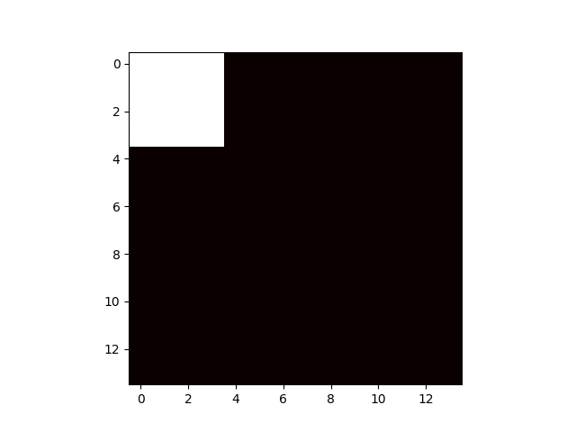

# shoveit: container packing optimiser
This code is just the start of an experiment with packing algorithms. 

Currently the functionality is extremly limited, and it is slow. The reason for this is:

## Algorithm
Currently this only does a very stupid brute force approach with a few heuristics tacked on the make it even vaguely tractable, but there is method to this madness (see later in doc):

* Order all input items by their area, so that the largest is placed first.
* Find the best position (allowing for rotations) for an item by trying all possible (allowed) placements and choosing the one which:
   * Yields the largest free-area-rectangle, and
   * Yields the smallest occupied-area-perimiter (aiming for 'snugness' of fit)

## Performance
On a 14 x 14 grid with 29 items it computes in ~0.3s (making extensive use of Numba). The default setup currently sets the random seed to result in a snug-fit example where everything fits perfectly and there is no free area remaining. This is a useful test because one can turn off allowing rotations, or other aspects, and see that this fails to pack all the items.

Given the brute-force placement algorithm this scales very poorly with the size of the grid, so even for a large container with few items, this would be slow. 

## But why?
The point of this exercise is not to make a good packing optimiser code, but to make good training data. I would like to test the use of [pointer networks](https://arxiv.org/abs/1506.03134) for this (which Alibaba [already use](https://www.ijcai.org/proceedings/2017/0002.pdf)). For this reason slow but accurate data generation is preferable to fast heuristic data. 

### However...
To verify that this isn't a stupid idea I still need to include those common heuristics (e.g. place largest in top left, recursively continue) and see if there is any measurable difference in accuracy.

## But, really, why?
There are several existing (mostly propriety but a few open source) examples of codes for this sort of thing but the number rapidly dwindles once other constraints are added, for example packing order, requirements that certain things cannot be stacked on top of other things (obviously in the context of a 3D packer, the goal). 

As such the point is to try and develop a robust (either NN or 'rule based') 3D packing optimiser code that is capable of dealing with a variety of  interesting constraints that might crop up, and see if something like a pointer network is the correct path forward or not.

#### Requirements
* numpy
* numba
* matplotlib

## Todo
* Better plot handling (offload to list, to disk later)
* Config file input
* Test against best 2D heuristics
* Make 3D
* Codify desired constraints
* Implement/pinch pointer network